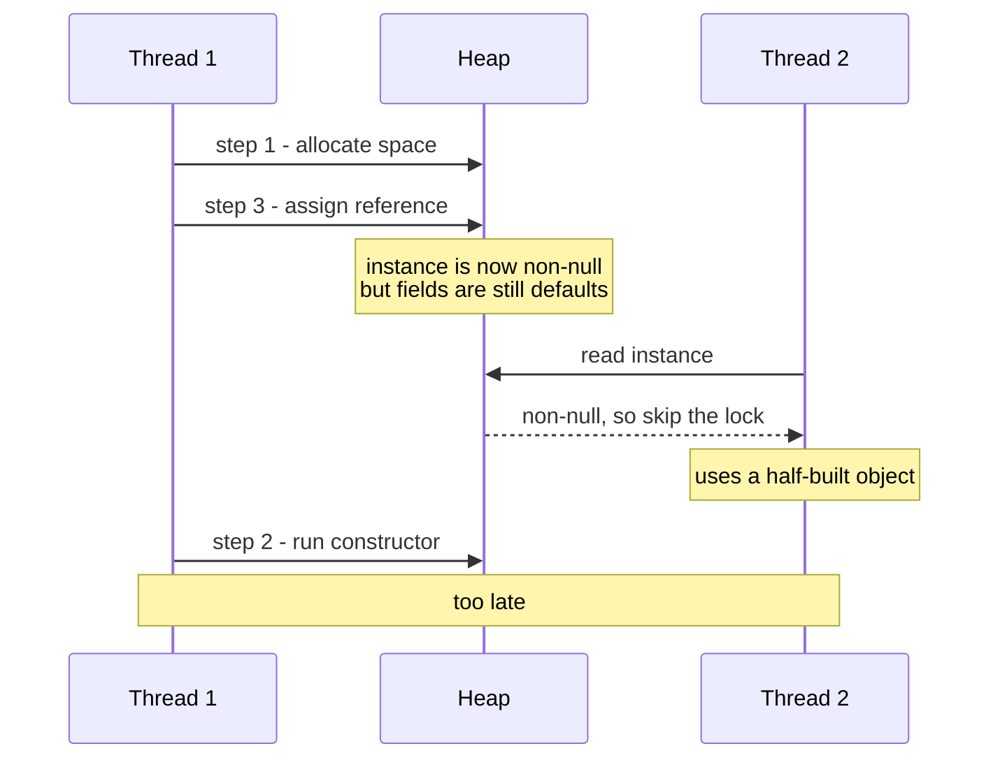
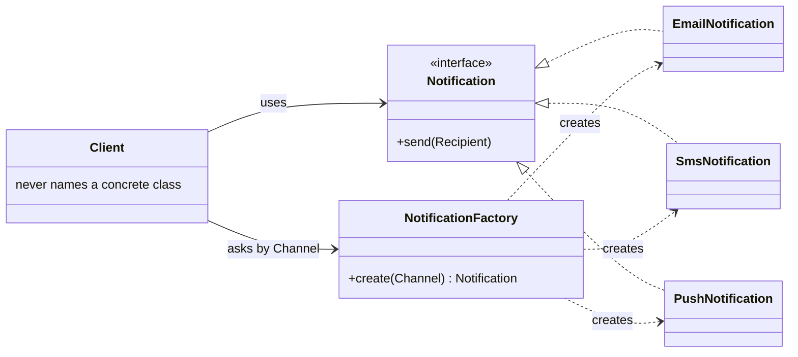
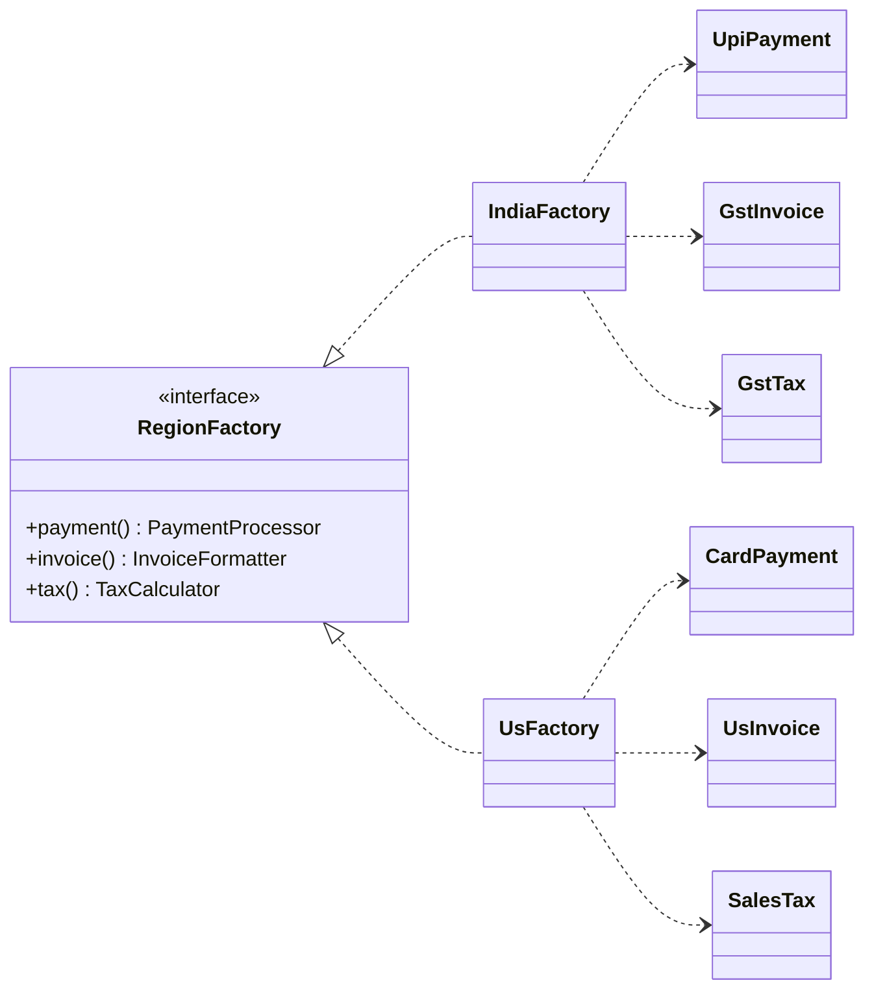
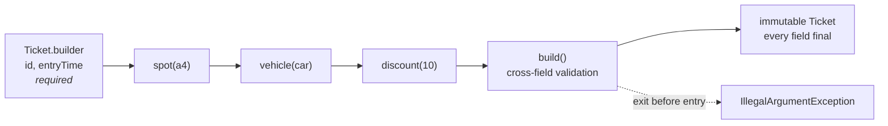
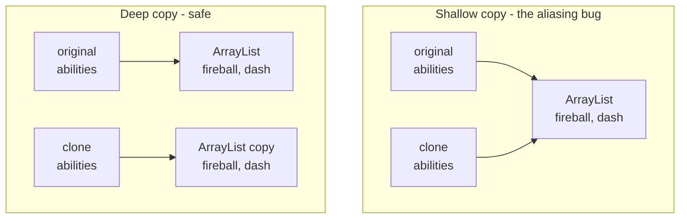
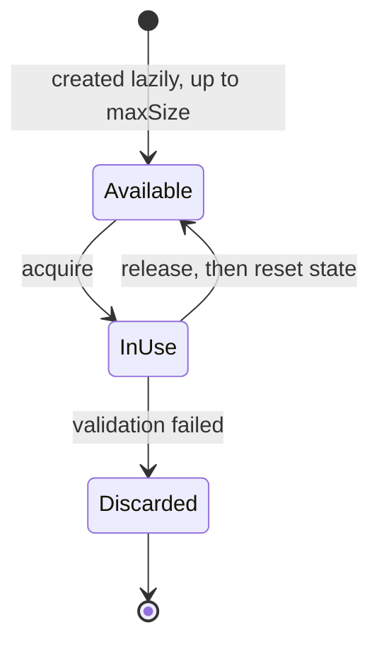
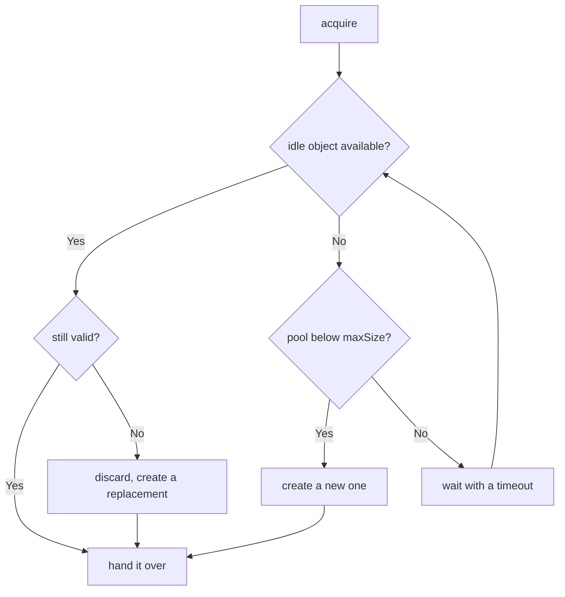

# Creational Patterns — Deep Dive

Detailed reference for the 6 creational patterns. Each entry gives you the *intent*, the *pain it
removes*, real JDK usage, when **not** to use it, a one-paragraph soundbite you can say out loud,
and the follow-up questions interviewers reliably ask.

Code: [`src/com/lld/patterns/creational`](../../src/com/lld/patterns/creational)

---

## Singleton

**Intent:** Ensure a class has exactly one instance and provide a global access point to it.

**The problem it solves.** Some resources are genuinely single: a connection pool, an in-memory
cache, an application config, the one `ParkingLot` object the whole system coordinates through.
Creating several would either waste resources or, worse, split state so two parts of the system
disagree about reality.

**Participants.** Just the class itself: a private constructor (blocks `new` from outside), a
private static field holding the instance, and a public static accessor.

**The five implementations, ranked.**

| Approach | Lazy? | Thread-safe? | Verdict |
|---|---|---|---|
| Eager (`static final INSTANCE = new X()`) | No | Yes (class init) | Fine when construction is cheap |
| Synchronized `getInstance()` | Yes | Yes | Correct but locks on **every** call |
| Double-checked locking + `volatile` | Yes | Yes | Correct; `volatile` is mandatory |
| **Bill Pugh holder idiom** | Yes | Yes | **Preferred** — lazy, lock-free, simple |
| `enum Singleton { INSTANCE }` | No | Yes | Safest — free serialization & reflection protection |

**Why `volatile` is non-negotiable in DCL.** `instance = new ConnectionPool()` is three steps:
allocate memory, run the constructor, assign the reference. Without `volatile` the JVM may reorder
steps 2 and 3, so another thread can observe a **non-null but half-constructed** object. `volatile`
forbids that reordering and guarantees visibility across threads.



The reordering of steps 2 and 3 is legal without `volatile`. That is the entire bug.

**In the wild:** `Runtime.getRuntime()`, `java.awt.Desktop.getDesktop()`, Spring beans (singleton
scope by default — but managed by the container, which is the better model).

**When NOT to use it.**
- When you're really just avoiding passing a parameter. That's laziness, not design.
- When the object holds mutable request-scoped state — you've created a race condition.
- In code you want to unit test. A singleton is a hidden global dependency you can't substitute.

**Interview soundbite.** *"I'll make `ParkingLot` a singleton via the Bill Pugh holder idiom — it's
lazy and thread-safe without synchronization overhead. That said, singletons are global state, so
I'd still inject it into services through their constructors rather than calling `getInstance()`
everywhere; that keeps the classes testable."*

**Follow-ups you'll get.**
- *"How do you break a singleton?"* → Reflection (`setAccessible(true)` on the private ctor),
  serialization (deserializing creates a new instance — fix with `readResolve()`), and cloning
  (override `clone()` to throw). An `enum` singleton is immune to all three.
- *"Singleton across a cluster?"* → It isn't. JVM-scoped only. For cluster-wide singletons you need
  distributed coordination (ZooKeeper/etcd leader election).
- *"Singleton vs static class?"* → A singleton can implement interfaces, be passed as a parameter,
  be lazily initialized, and be swapped for a test double. Statics can't.

---

## Factory Method

**Intent:** Define an interface for creating an object, but let a factory (or subclass) decide which
concrete class to instantiate.

**The problem it solves.** Client code that says `new EmailNotification()` is welded to that class.
When the channel becomes runtime-configurable, that `new` turns into a `switch` — and then the same
`switch` gets copy-pasted into five call sites. A factory pulls that decision into **one** place.

**Structure.** A product interface, several concrete products, and a factory that maps some input
(enum, string, config) to a concrete product. Callers depend only on the interface.



The `Client` has two edges and neither touches a concrete product. That is the whole benefit — the
`switch` exists once, inside the factory, instead of at five call sites.

**Two variants worth naming.**
- *Simple Factory* (what most people mean): one factory class with a `create(type)` method. Not
  technically GoF, but it's what you'll write.
- *Factory Method* (true GoF): an abstract creator class defers instantiation to subclasses that
  override a `createProduct()` hook. Use when the creator itself has behaviour worth inheriting.

**Registry variant (worth mentioning for extra credit).** Replace the `switch` with a
`Map<Type, Supplier<Product>>` populated at startup. Now adding a product requires **zero** edits to
the factory — true Open/Closed.

```java
private static final Map<Channel, Supplier<Notification>> REGISTRY =
        Map.of(Channel.EMAIL, EmailNotification::new,
               Channel.SMS,   SmsNotification::new);
```

**In the wild:** `Calendar.getInstance()`, `NumberFormat.getInstance()`, `LocalDate.of(...)`,
`Executors.newFixedThreadPool(...)`, `DriverManager.getConnection(url)`.

**When NOT to use it.** When there's only one implementation and no sign of a second. `new Foo()` is
clearer than `FooFactory.create()` until variation actually exists (YAGNI).

**Interview soundbite.** *"I'll put spot creation behind a `ParkingSpotFactory`. Callers ask for a
spot by `SpotType` and get back a `ParkingSpot` — they never name a concrete class. Adding an EV
spot later means adding one class and one registry entry; no existing code changes. That's Open/
Closed plus Dependency Inversion in one move."*

**Follow-ups you'll get.**
- *"Doesn't the factory still violate OCP with its switch?"* → Yes, mildly. That's the trade-off:
  you've localized the change to one line in one file. Use the registry/`Map<Type, Supplier>`
  variant to eliminate even that.
- *"Factory vs Builder?"* → Factory picks **which class**; Builder configures **how one instance is
  assembled**. They compose fine — a factory can return a builder.

---

## Abstract Factory

**Intent:** Provide an interface for creating **families** of related objects without specifying
their concrete classes.

**The problem it solves.** Consistency. If your app can produce `WindowsButton` and `MacCheckbox`
independently, someone will eventually mix them and ship a broken UI. An abstract factory makes the
inconsistent combination *unrepresentable*: you pick the family once, and every product you get from
that factory matches.

**Structure.** An abstract factory interface with one creation method per product type; one concrete
factory per family; product interfaces + concrete products per family. Client holds the abstract
factory and never sees a concrete product class.



Because the client picks a factory once, pairing `GstTax` with `UsInvoice` is not merely discouraged —
there is no code path that produces it.

**The key distinction from Factory Method.** Factory Method = one product, chosen by subclassing.
Abstract Factory = *N* related products, chosen by swapping one factory object. Abstract Factory is
usually implemented *using* several factory methods.

**Real LLD uses.** Cross-platform UI toolkits, database-vendor families (`Connection` +
`Command` + `Transaction` for MySQL vs Postgres), theme systems (dark/light widget sets), test vs
production object graphs, cloud-provider SDK families (AWS vs Azure storage + queue + compute).

**In the wild:** `DocumentBuilderFactory`, `TransformerFactory`, `javax.xml.parsers.SAXParserFactory`.

**When NOT to use it.** When you have exactly one family (you just need a Factory), or when product
types are still churning — every new product type forces a change to the abstract factory interface
**and every concrete factory**. That's the pattern's main cost.

**Interview soundbite.** *"Since a booking flow needs a matched `PaymentProcessor`, `InvoiceFormatter`
and `TaxCalculator` per region, I'd use an Abstract Factory keyed by region. That makes it impossible
to pair the Indian tax calculator with the US invoice format — the compiler enforces the family."*

**Follow-ups you'll get.**
- *"What's the cost of adding a new product type?"* → You edit the factory interface and every
  concrete factory. Adding a new *family* is cheap; adding a new *product type* is expensive. Say
  this out loud — it shows you understand the trade-off, not just the shape.

---

## Builder

**Intent:** Separate the construction of a complex object from its representation, so the same
construction process can produce different results.

**The problem it solves.** The **telescoping constructor**:
`new Pizza("large", true, false, true, false, true)` — unreadable, and swapping two booleans
compiles fine while being completely wrong. The alternative (setters) forces you to make the class
mutable and lets callers use a half-built object.

Builder gives you: readable named steps, immutability (all fields `final`), required-vs-optional
distinction, and a single `build()` where you can validate cross-field invariants.

**Structure.** A static nested `Builder` class mirrors the product's fields; each setter returns
`this` for chaining; `build()` validates and calls the product's private constructor.



Required arguments enter through the builder's constructor, so they cannot be forgotten; optional
ones are named method calls, so they cannot be transposed. Validation waits for `build()` because
cross-field rules need the complete picture.

**Design details that earn points.**
- Put **required** args in the builder's constructor, optional ones in fluent methods.
- Validate in `build()`, not in each setter — you need the complete picture for cross-field rules
  (e.g. "discount can't exceed price").
- Return a **new** product each `build()` call so a reused builder can't mutate an already-built object.
- The **Director** (GoF's original) is optional and usually skipped; it encapsulates common recipes
  like `Director.buildMargherita(builder)`.

**In the wild:** `StringBuilder`, `Stream.Builder`, `Locale.Builder`,
`HttpRequest.newBuilder()...build()`, `Calendar.Builder`, Lombok's `@Builder`.

**When NOT to use it.** Fewer than ~4 fields, or all fields required — a constructor or a Java
`record` is simpler and clearer. Don't add 40 lines of builder boilerplate to a 3-field class.

**Interview soundbite.** *"`Ticket` has eight fields, half optional, and must be immutable once
issued — that's a textbook Builder. Required fields go in the builder constructor so you can't forget
them, and `build()` validates that entry time precedes exit time before handing back an immutable
object."*

**Follow-ups you'll get.**
- *"Is your builder thread-safe?"* → No, and it shouldn't be. A builder is a short-lived, single-
  threaded scratchpad; the *product* is immutable and therefore safe to share.
- *"How would you enforce required fields at compile time?"* → A **step builder**: each step returns
  a different interface exposing only the next legal call, so `build()` isn't reachable until all
  required steps are done.

---

## Prototype

**Intent:** Create new objects by copying an existing configured instance rather than constructing
from scratch.

**The problem it solves.** Two situations. (1) Construction is genuinely expensive — it hits a DB,
parses a file, or does heavy computation, and you need 1,000 near-identical instances. (2) You have a
*configured* object and want variations of it, but the configuration lives in dozens of fields you'd
otherwise have to re-specify.

**The critical decision: shallow vs deep copy.**
- **Shallow** copies field values; object references are *shared*. Mutating a nested list in the
  clone corrupts the original. Fine only if all nested state is immutable.
- **Deep** copies nested mutable objects recursively. Safe but costlier, and you must handle cycles.



In the left case `clone.abilities.add(...)` silently mutates the original. That is the failure the
copy constructor below is written to prevent.

Java's `Cloneable`/`Object.clone()` is widely considered broken (marker interface, protected method,
shallow by default, doesn't play well with `final` fields). **Prefer a copy constructor or a static
`copyOf` factory** — say this in an interview, it's a real signal.

```java
// Preferred over Cloneable
Enemy(Enemy other) {
    this.type = other.type;
    this.abilities = new ArrayList<>(other.abilities); // deep copy of mutable state
}
```

**Real LLD uses.** Game entity spawning, document/email templates, pre-configured report definitions,
a **prototype registry** (`Map<String, Shape>` you clone from by key), and snapshotting an object
graph before a speculative operation.

**In the wild:** `Object.clone()`, `ArrayList.clone()`, `Cloneable` implementers across the JDK.

**When NOT to use it.** When construction is cheap, or when the object is immutable — an immutable
object never needs copying, just share the reference.

**Interview soundbite.** *"Rather than `Cloneable`, I'd expose a copy constructor and deep-copy the
mutable collections. It's explicit, works with `final` fields, and I control exactly which references
are shared versus copied."*

**Follow-ups you'll get.**
- *"Deep copy with cycles?"* → Track visited objects in an `IdentityHashMap` during the copy, or
  serialize/deserialize (slow, but handles cycles for free).

---

## Object Pool

**Intent:** Recycle a bounded set of expensive-to-create objects instead of allocating and
discarding them.

**The problem it solves.** Some objects are expensive not to *use* but to *create*: a DB connection
means a TCP handshake plus authentication; a thread means an OS-level allocation. Under load,
create/destroy churn dominates your latency. A pool amortizes that cost across many borrowers.

**Lifecycle.** `acquire()` → use → `release()`. The pool creates lazily up to `maxSize`, blocks (or
times out) when exhausted, and **resets object state** on release.



The borrower's side is where the interesting decisions live:



The arrow from `wait` back to the **condition check** rather than straight to `hand it over` is why
`wait()` belongs in a `while` loop — see below.

**The four things you must address (interviewers probe all of them).**
1. **Thread safety.** `acquire`/`release` are critical sections. Use `synchronized` + `wait/notifyAll`,
   or a `Semaphore` + `ConcurrentLinkedQueue`, or just a `BlockingQueue`.
2. **State reset.** If you hand back a connection with an open transaction or a buffer with the
   previous user's bytes, you have a correctness bug and a **security leak**.
3. **Exhaustion policy.** Block forever? Block with timeout? Throw? Grow past max? Pick one and
   justify it. Blocking forever is how production deadlocks happen.
4. **Leak detection & validation.** A borrower that never calls `release()` starves everyone —
   hence try-with-resources / `finally`. Also validate objects on borrow (a pooled connection may
   have been closed by the server).

**Why `while` not `if` around `wait()`.** Threads can wake spuriously, and between `notifyAll()` and
reacquiring the lock another thread may have taken the object. Always re-check the condition in a loop.

**In the wild:** HikariCP / Apache Commons Pool, `Executors` thread pools, Netty's `ByteBuf` pooling,
`Integer.valueOf()` caching −128..127.

**When NOT to use it.** When objects are cheap to create — modern JVM allocation plus generational GC
beats pool bookkeeping. Pooling cheap objects is a classic premature optimization, and it *adds* the
state-reset bug class for nothing.

**Interview soundbite.** *"I'll pool connections with a max size of N, blocking with a timeout on
exhaustion so a slow query can't deadlock the service, and I'll reset transaction state in
`release()`. Borrowers use try-with-resources so a thrown exception still returns the connection."*

**Follow-ups you'll get.**
- *"How do you size the pool?"* → Roughly `threads × (1 + wait_time/service_time)`, capped by what
  the downstream (DB) can handle. Oversizing just moves the queue to the database.
- *"Pool vs just creating threads?"* → Pool bounds concurrency, which is often the *point* — it
  protects the downstream system as much as it saves allocation cost.
