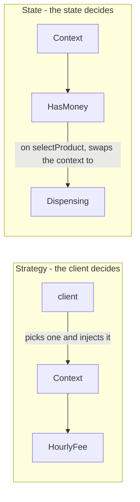
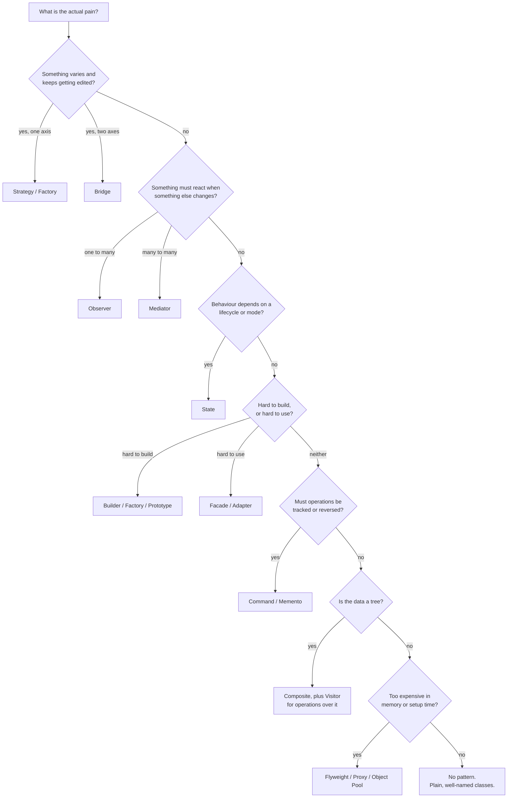

# Pattern Cheat Sheet — pick the right tool fast

Use this to map a problem symptom to a candidate pattern during an interview.
Covers all **23 GoF patterns** plus the **practical/architectural patterns** that show up in
SDE-2 / senior LLD rounds.

> This page is the **quick index**. For the full treatment of any pattern — the problem it solves,
> real JDK usage, when *not* to use it, interview soundbites, and the follow-up questions you'll get —
> see the deep dives: [Creational](../2-patterns/1-creational.md) · [Structural](../2-patterns/2-structural.md) ·
> [Behavioral](../2-patterns/3-behavioral.md) · [Practical](../2-patterns/4-practical.md).

---

## "I need to..." → pattern

### Creational — object creation
| When you hear / feel this | Reach for |
|---|---|
| Centralize/hide object creation, pick class at runtime | **Factory Method** |
| Create families of related objects that must match | **Abstract Factory** |
| Build a complex object with many optional fields | **Builder** |
| Ensure exactly one instance | **Singleton** |
| Cloning an existing object is cheaper than building | **Prototype** |
| Reuse expensive objects instead of reallocating | **Object Pool** |

### Structural — object composition
| When you hear / feel this | Reach for |
|---|---|
| Make two incompatible interfaces work together | **Adapter** |
| Add responsibilities to an object at runtime | **Decorator** |
| Provide a simple entry point to a complex subsystem | **Facade** |
| Model a part-whole tree uniformly | **Composite** |
| Control access, add caching/lazy-loading/auth | **Proxy** |
| Two dimensions of variation causing a class explosion | **Bridge** |
| Millions of similar objects blowing up memory | **Flyweight** |

### Behavioral — object interaction
| When you hear / feel this | Reach for |
|---|---|
| Swap algorithms/behavior at runtime | **Strategy** |
| Notify many objects when one changes | **Observer** |
| Behavior depends on an internal mode/lifecycle | **State** |
| Turn a request into an object (undo, queue, log) | **Command** |
| Pass a request through a pipeline of handlers | **Chain of Responsibility** |
| Fix an algorithm's skeleton, vary some steps | **Template Method** |
| Traverse a collection without exposing its internals | **Iterator** |
| Too many objects talking directly to each other (N×N) | **Mediator** |
| Snapshot & restore state without breaking encapsulation | **Memento** |
| Keep adding new operations over a stable class hierarchy | **Visitor** |
| Evaluate a small grammar / rule expression | **Interpreter** |

### Practical / architectural (not GoF, but interview gold)
| When you hear / feel this | Reach for |
|---|---|
| "Where does the database fit?" | **Repository** |
| Classes `new`-ing their own collaborators; hard to test | **Dependency Injection** |
| Null checks scattered everywhere | **Null Object** |
| Long compound `if` conditions encoding business rules | **Specification** |
| Decouple work creation from work processing | **Producer–Consumer** |
| Group multiple repository writes into one transaction | **Unit of Work** |
| A slow dependency is exhausting your thread pool | **Circuit Breaker** |
| "The client retried — did they pay twice?" | **Idempotency Key** |
| One operation grew five unrelated side effects | **Domain Events** |
| Expected failures returned as `null` or thrown | **Result / Either** |
| A `switch` on a string that every new feature edits | **Registry / Plugin** |
| Read model and write model have different needs | **CQRS** *(leans HLD)* |
| Need an audit trail / rebuildable state | **Event Sourcing** *(leans HLD)* |
| Expose an entity to callers as a plain data carrier | **DTO** (Java `record`) |

---

## Distinguishing the confusing pairs

**Creational**
- **Factory Method vs Abstract Factory:** Factory Method makes *one* product; Abstract Factory makes
  a *family* of related products that must be used together.
- **Builder vs Factory:** Factory decides *which class*; Builder decides *how to assemble one class*
  step by step. Builder shines with many optional params.
- **Prototype vs Factory:** Prototype copies a configured instance; Factory constructs from scratch.
- **Singleton vs Object Pool:** Singleton = exactly one; Object Pool = a bounded, reusable set.

**Structural**
- **Decorator vs Proxy:** same interface, different *intent*. Decorator **adds behavior**;
  Proxy **controls access** (lazy, cache, auth, throttle).
- **Decorator vs Composite:** both recurse. Decorator wraps *one* child to enhance it;
  Composite holds *many* children and treats the tree uniformly.
- **Adapter vs Facade:** Adapter **converts** one interface to another (usually 1↔1);
  Facade **simplifies** many subsystems into one new interface.
- **Adapter vs Bridge:** Adapter is retro-fitted onto existing incompatible code;
  Bridge is designed up front so two dimensions can vary independently.
- **Flyweight vs Singleton:** Flyweight shares *many* instances keyed by intrinsic state;
  Singleton shares exactly one.

**Behavioral**
- **Strategy vs State:** the client picks a **Strategy**; a **State** object transitions itself in
  response to events. Same UML, opposite intent.
- **Strategy vs Template Method:** Strategy swaps a whole algorithm via *composition*;
  Template Method varies *steps* of a fixed skeleton via *inheritance*.
- **Observer vs Mediator:** Observer is a one-way broadcast of state change;
  Mediator centralizes bidirectional **coordination logic** and can route/transform/block.
- **Command vs Memento (for undo):** Command replays an **inverse operation** (memory-cheap,
  logic-heavy); Memento restores a **full snapshot** (simple, memory-heavy).
- **Chain of Responsibility vs Decorator:** CoR handlers may **stop** the chain;
  Decorators always delegate onward and each adds behavior.
- **Visitor vs Strategy:** Visitor dispatches on the *element type* (double dispatch);
  Strategy is one algorithm applied uniformly.

Strategy and State draw the same class diagram, so the difference is only visible at runtime — in
**who performs the swap**:

**Practical**
- **Registry vs Factory:** a Factory *decides* which object to create, so it changes when the product
  set changes; a Registry *looks up* something handed to it and never knows the concrete types.
- **Registry vs Service Locator:** same `Map`, opposite verdicts. Looking up an implementation chosen
  by **runtime data** is fine; a class fetching its own **fixed dependencies** from a global registry
  has hidden them from the constructor — inject those instead.
- **Domain Events vs Observer:** Observer couples a subject to its own listeners; Domain Events are
  typed facts on a shared bus, so publisher and subscriber never reference each other.
- **Result vs Optional:** `Optional` models *absence*; `Result` models *failure with a reason* — and
  the reason is what the caller needs to build a 400 response.
- **Circuit Breaker vs Retry:** Retry handles the *transient* blip; the breaker handles the
  *sustained* outage. Use both, retry inside the breaker.

---

## Trade-offs worth volunteering

| Pattern | The cost you should mention |
|---|---|
| Singleton | Global state, hidden dependencies, hard to test, thread-safety care needed |
| Builder | Extra boilerplate; overkill for 2–3 fields |
| Abstract Factory | Adding a new *product type* changes every factory |
| Decorator | Many small classes; debugging deep wrapper stacks is painful |
| Proxy | Extra indirection; cache invalidation becomes your problem |
| Flyweight | Only pays off at scale; intrinsic state must be immutable |
| Observer | Notification order is undefined; leaks if you never unsubscribe |
| State | A class per state can be verbose for tiny machines |
| Visitor | Adding a new *element type* breaks every visitor |
| Interpreter | Doesn't scale past a small grammar — use a real parser |
| Mediator | The mediator can grow into a god object |
| Object Pool | Must reset state on release, or data leaks between borrowers |

---

## Frequency in interviews (rough)

- **Very common:** Strategy, Observer, Factory, Builder, Singleton, State
- **Common:** Decorator, Adapter, Facade, Command, Composite, Repository, Dependency Injection
- **Situational:** Proxy, Chain of Responsibility, Template Method, Abstract Factory, Iterator,
  Producer–Consumer, Null Object, Specification
- **Rare (know the idea, rarely code it):** Prototype, Bridge, Flyweight, Mediator, Memento,
  Visitor, Interpreter

---

## Classic problems → likely patterns

> **Want the reasoning?** [Classic Problems](2-problems.md) explains *why* each pattern was chosen for each
> problem — the variation points that drive the design, the alternative you'd reject, and the one
> question interviewers always probe. Click any problem below to jump to its breakdown.

> **Short on time?** [Tic-Tac-Toe](2-problems.md#tic-tac-toe-and-chess),
> [meeting room scheduler](2-problems.md#meeting-room-scheduler) and
> [undo/redo](2-problems.md#undo-and-redo-system) are the three that genuinely fit in 45 minutes, and
> each carries an explicit minute-by-minute budget plus a list of what to cut. The rest are 60–90
> minute designs — expect an interviewer to hand you a slice of one, not all of it.

| Problem | Patterns you'll likely use | The core reason |
|---|---|---|
| [Parking Lot](2-problems.md#parking-lot) | Strategy (fees), Factory (spots), Singleton (lot), State (ticket) | Pricing and spot types are the named axes of change |
| [Vending Machine](2-problems.md#vending-machine) | State, Strategy, Singleton | It *is* a state machine — every op is state-dependent |
| [Elevator system](2-problems.md#elevator-system) | State, Strategy (scheduling), Observer, Command (requests) | Scheduling is the real problem; requests must be queueable objects |
| [Notification service](2-problems.md#notification-service) | Bridge (type × channel), Strategy, Factory, Observer, Decorator | Two independent axes → M+N classes instead of M×N |
| [Splitwise / expense sharing](2-problems.md#splitwise-expense-sharing) | Strategy (split types), Observer, Factory | The requirement names four split types and implies more |
| [Tic-Tac-Toe / Chess](2-problems.md#tic-tac-toe-and-chess) | Strategy, State, Factory, Command (moves/undo), Memento | Moves must be reversible objects; pieces move polymorphically |
| [Logging framework](2-problems.md#logging-framework) | Chain of Responsibility, Strategy, Producer–Consumer (async), Singleton | Level filtering is naturally a chain; writes must not block |
| [Rate limiter](2-problems.md#rate-limiter) | Strategy (algorithm), Proxy, Singleton | The algorithm *is* the requirement; must wrap services transparently |
| [Food delivery / ride hailing](2-problems.md#food-delivery-and-ride-hailing) | Mediator, Strategy (matching/pricing), State, Observer | Riders and drivers must never reference each other |
| [Cache (LRU/LFU)](2-problems.md#cache-with-lru-or-lfu-eviction) | Strategy (eviction), Proxy, Singleton | Eviction is the stated variation; O(1) is the hidden test |
| [Gaming leaderboard](2-problems.md#gaming-leaderboard) | Strategy (rank index, scoring), Observer, Facade, DTO | Three ops need three structures; "what rank am I?" stays O(n) unless you notice |
| [Text editor / IDE](2-problems.md#text-editor) | Command + Memento (undo), Composite (doc tree), Flyweight (glyphs), Iterator | Undo needs operations as objects; a million glyphs need sharing |
| [Snake & Ladder / board games](2-problems.md#snake-and-ladder) | Factory, Strategy (dice), Observer, State | Tests **restraint** — the trap is over-engineering |
| [ATM machine](2-problems.md#atm-machine) | State, Chain of Responsibility (note dispensing), Strategy, Template Method | Strict operation ordering; denominations cascade naturally |
| [Online shopping cart](2-problems.md#online-shopping-cart) | Strategy, Specification (offers), Visitor (tax/shipping), Facade, Repository | Every concern varies *independently* |
| [File system / directory tree](2-problems.md#file-system) | Composite, Visitor (search & reports), Iterator, Proxy | Two node types forever, but operations keep growing |
| [Message broker / task queue](2-problems.md#message-broker-and-task-queue) | Producer–Consumer, Observer, Command, Object Pool | Bounded queue = back-pressure instead of OOM |
| [Library management](2-problems.md#library-management) | Repository, State (book status), Observer (waitlist), Specification (search) | Modelling Book vs BookCopy matters more than any pattern |
| [Hotel / movie booking](2-problems.md#hotel-and-movie-booking) | State (booking), Strategy (pricing), Facade, Repository, Observer | Double-booking is the real question; holds need a TTL |
| [Meeting room scheduler](2-problems.md#meeting-room-scheduler) | Facade, value objects (intervals), Strategy (allocation) | Half-open intervals, and conflict detection that isn't a scan |
| [Traffic light controller](2-problems.md#traffic-light-controller) | State, Observer, Singleton | The canonical minimal state machine + a safety invariant |
| [Document converter / exporter](2-problems.md#document-converter) | Visitor, Composite, Bridge, Strategy, Template Method | Stable node types, growing export targets |
| [Undo/redo system](2-problems.md#undo-and-redo-system) | Command, Memento, Composite (macros) | The point *is* the Command-vs-Memento trade-off |
| [Rule / discount engine](2-problems.md#rule-and-discount-engine) | Specification, Strategy, Chain of Responsibility, Interpreter | "Does it apply?" and "how much?" are different questions |
| [Game world (units, terrain)](2-problems.md#game-world) | Flyweight, Prototype, Object Pool, State, Composite | Scale is what makes Flyweight correct rather than premature |
| [Airline / air-traffic control](2-problems.md#air-traffic-control) | Mediator, Observer, State, Strategy, Command | Safety rules must be centralized to be verifiable |
| [Stock trading platform](2-problems.md#stock-trading-platform) | Observer, Strategy (order types), Command, State, Producer–Consumer | Order book data structure is the real differentiator |

---

## 30-second pattern selection heuristic

1. **What varies?** Isolate it behind an interface. → Strategy / Factory / Bridge
2. **What reacts?** Something must know when something else changes. → Observer / Mediator
3. **What has a lifecycle?** Behavior differs by mode. → State
4. **What is complex to build?** → Builder / Factory / Prototype
5. **What is complex to use?** → Facade / Adapter
6. **What must be tracked or reversed?** → Command / Memento
7. **What is a tree?** → Composite (+ Visitor for operations over it)
8. **What is too expensive?** → Flyweight / Proxy / Object Pool

> If none of these fit cleanly, **don't force a pattern**. Plain, well-named classes with clear
> responsibilities beat a misapplied pattern every time — and saying so out loud is a senior signal.
