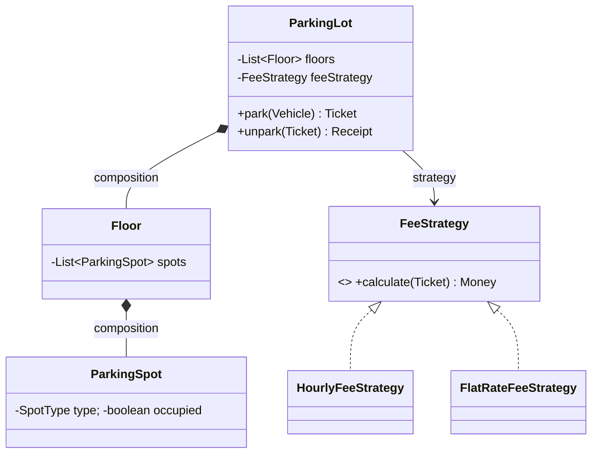

# The LLD Interview Approach

A repeatable, time-boxed framework for a 45–60 minute LLD round. Interviewers assess how you
*think*, not whether you memorized UML. Talk out loud and drive the conversation.

---

## 0. Mindset (SDE 2 / Senior bar)

You are expected to:
- Turn a vague prompt into a crisp, bounded problem.
- Model the domain with clean classes and clear responsibilities.
- Apply SOLID and pick patterns *only where they earn their keep*.
- Discuss trade-offs (extensibility, concurrency, performance) proactively.
- Write compiling, readable code for the core flow.

### What actually separates SDE 2 from Senior

Both levels are given the same prompt. The difference is almost never "knew more patterns."

| Dimension | SDE 2 answer | Senior answer |
|---|---|---|
| **Requirements** | Answers the question asked | Bounds the problem, states assumptions, declares what's out of scope |
| **Patterns** | Applies a pattern correctly | Explains *why this one*, names the alternative, and states the cost |
| **Trade-offs** | Mentions them when asked | Volunteers them unprompted, with a recommendation |
| **Concurrency** | "I'd add `synchronized`" | Names the specific race, picks a lock granularity, justifies it |
| **Extensibility** | "It's extensible" | Walks through a concrete future change and shows nothing existing breaks |
| **Communication** | Answers questions | Drives the session, manages the clock, checks in for alignment |
| **Judgment** | Uses patterns | Knows when *not* to — and says so |

The last row matters most. Deliberately rejecting a pattern ("a Builder here would be boilerplate for
three fields — a record is better") is one of the strongest senior signals available.

### Time-box at a glance

| Phase | 45 min | 60 min | Skip only if... |
|---|---|---|---|
| Clarify & scope | 5 | 6 | never skip |
| Entities & enums | 4 | 5 | never skip |
| APIs / interfaces | 4 | 5 | never skip |
| Class design | 10 | 14 | you're short on time — compress, don't cut |
| Code core flow | 16 | 22 | never skip |
| Trade-offs & extensions | 6 | 8 | you overran — but say them out loud anyway |

If you're 20 minutes in and haven't written a class, you're behind. If you're 20 minutes in and
haven't asked a question, you're in worse trouble.

---

## 1. Clarify & scope (3–5 min)

Do **not** start coding. Nail down:
- **Functional requirements** — what must it do? List 4–6 core use cases.
- **Out of scope** — say what you will *not* build (payments, auth, persistence...). Bounding scope is a senior signal.
- **Actors** — who/what uses the system?
- **Scale/constraints** — single machine? concurrent users? read/write heavy?

> Restate the problem back to the interviewer and get a nod before proceeding.

**Example (Parking Lot):** "So we need multiple floors, several spot sizes (motorcycle/car/large),
ticket issuing, and fee calculation by duration. Payments and license-plate recognition are out of scope. Correct?"

### A question bank you can reuse on any prompt

Most LLD prompts are deliberately vague. These questions work almost everywhere — pick 4–5:

| Category | Ask |
|---|---|
| **Scope** | "What are the 3–4 operations that absolutely must work?" |
| **Scope** | "Should I handle payments/auth/persistence, or assume they exist?" |
| **Actors** | "Who uses this — end users, admins, other services?" |
| **Multiplicity** | "One instance or many? One floor or many? One location or many?" |
| **Variation** | "Will the pricing/matching/eviction rules change over time?" ← *this reveals where a Strategy goes* |
| **Lifecycle** | "What states can an order/ticket/booking be in?" ← *this reveals a State machine* |
| **Concurrency** | "Can two users act on the same resource simultaneously?" |
| **Scale** | "Roughly how many spots/users/items? In-memory or backed by a DB?" |
| **Extension** | "Anything you'd like the design to make easy to add later?" ← *invites them to tell you the real test* |

**Red flag to avoid:** asking twelve questions. Ask a focused handful, state your assumptions for the
rest ("I'll assume single-location, in-memory state, and revisit if there's time"), and move.

### Write the requirements down

Keep a visible list in the shared editor. It anchors the conversation, and at the end you can walk
through it and show every requirement is met — a very strong close.

---

## 2. Identify core entities (3–5 min)

Extract the **nouns** → candidate classes. Extract the **verbs** → candidate methods/behaviors.

- Group nouns into entities, value objects, and enums.
- Note relationships: *has-a* (composition), *is-a* (inheritance — use sparingly), *uses-a*.
- Keep entities focused (Single Responsibility).

**Example:** `ParkingLot`, `Floor`, `ParkingSpot`, `Vehicle`, `Ticket`, `Gate`, `FeeStrategy`;
enums `VehicleType`, `SpotType`, `TicketStatus`.

### Classify each noun — it tells you how to model it

| Kind | Test | Modelling |
|---|---|---|
| **Entity** | Has identity that persists as its data changes | Class with an `id`; equality by id |
| **Value object** | Defined entirely by its values; interchangeable | Immutable; Java `record`; equality by value (`Money`, `Address`, `TimeSlot`) |
| **Enum** | Small, closed, known set | `enum` — and consider giving it behaviour |
| **Service** | A verb with no natural home on an entity | Stateless class (`FeeCalculator`, `SpotAllocator`) |
| **Aggregate root** | The entity you always load/save the group through | The only entity with a Repository |

**Anemic vs rich models.** If your classes are only fields + getters + setters and all the logic sits
in `XxxService`, that's an *anemic domain model*. Push behaviour onto the entity that owns the data:
`ticket.calculateDuration()` beats `TicketUtils.calculateDuration(ticket)`. Interviewers notice.

**Prefer enums with behaviour** over enums plus a switch:
```java
enum VehicleType {
    MOTORCYCLE(SpotType.SMALL), CAR(SpotType.MEDIUM), TRUCK(SpotType.LARGE);
    private final SpotType minSpot;
    VehicleType(SpotType minSpot) { this.minSpot = minSpot; }
    SpotType minimumSpot() { return minSpot; }
}
```

**Composition over inheritance.** Only use `extends` when the subtype is genuinely substitutable
(LSP). `ElectricCar extends Car` is usually wrong — an electric car is a car *with* a battery.
Prefer a field or a capability interface.

> **Going deeper.** This section is the interview-speed summary. [MODELLING.md](MODELLING.md) is the
> intuition behind it — the promotion ladder from primitive to value object to entity to interface,
> the four reasons an interface is worth its cost, ownership and leaking collections, tell-don't-ask,
> and a smell → move table. Diagram-heavy, and backed by a runnable demo that reproduces each failure.

---

## 3. Define APIs / interfaces (3–5 min)

Sketch the key operations before class internals:
```java
Ticket parkVehicle(Vehicle v);
Receipt unparkVehicle(Ticket t);
```
Program to **interfaces**. This is where extension points (Strategy, Factory) naturally appear.

### What makes an API "good" here

- **Return domain objects, not primitives.** `Ticket park(Vehicle)` beats `String park(String, int)`.
  Primitive-obsessed signatures lose type safety and read badly.
- **Make illegal states unrepresentable.** If a ticket can't exist without a spot, don't offer a
  constructor that allows it.
- **Decide the failure mode per operation** and say it: exception, `Optional`, or a result object.
  "`park` throws `NoSpotAvailableException` because it's exceptional; `findSpot` returns
  `Optional<Spot>` because absence is normal" — that sentence alone is a senior signal.
- **Keep the interface narrow** (ISP). Six focused interfaces beat one with 20 methods.

### Name the extension points out loud

As you write each signature, ask "what varies here?" and say the answer:
> "`calculateFee` is where pricing varies, so that becomes a `FeeStrategy` rather than a method body."

That single habit is what makes an interviewer write "applies patterns with judgment."

---

## 4. Class design & relationships (10–15 min)

- Draw a lightweight class diagram (boxes + arrows) or describe it verbally.
- Assign responsibilities; avoid god classes.
- Decide where behavior *varies* → that variation point wants a pattern:
  - Interchangeable algorithm → **Strategy**
  - Object creation you want to centralize → **Factory**
  - Notify many on change → **Observer**
  - Behavior depends on mode/lifecycle → **State**
- Call out SOLID as you go ("I'll depend on a `FeeStrategy` interface — Open/Closed + DIP").

### Relationship vocabulary (use the right word — interviewers listen for it)

| Relationship | Meaning | Lifetime | Example |
|---|---|---|---|
| **Composition** | Owns; part can't exist alone | Child dies with parent | `Floor` → `ParkingSpot` |
| **Aggregation** | Has, but doesn't own | Independent | `Playlist` → `Song` |
| **Association** | Uses / knows about | Independent | `Order` → `Customer` |
| **Dependency** | Transient use (parameter, local) | None | `FeeCalculator` uses `Clock` |
| **Inheritance** | Is-a; must satisfy LSP | n/a | `Circle` → `Shape` |

### A layering that always works

```
Controller / CLI        ← thin: parse input, call one service method
   ↓
Service / Facade        ← orchestration, transaction boundary
   ↓
Domain (entities,       ← the business rules live HERE
  value objects,
  strategies, states)
   ↓
Repository interface    ← domain-owned abstraction
   ↓
Infrastructure impl     ← JDBC / in-memory / HTTP
```
Dependencies point **inward**. The domain never imports infrastructure — that's the Dependency
Inversion Principle expressed as architecture.

### A minimal diagram is enough

You don't need formal UML. Boxes, fields, and arrows labelled with the relationship are plenty:



### Sanity checks before you code

- Can you name each class's **one** responsibility in a sentence without "and"?
- Does any class have more than ~7 fields? (Probably two classes.)
- Is there a `switch` on a type that will grow? (Probably a Strategy or polymorphism.)
- Does the domain reference a database, HTTP, or a framework? (Invert it.)

---

## 5. Code the core flow (10–15 min)

- Implement the **happy path** end to end, not every class fully.
- Use enums, interfaces, and clear names. Keep methods short.
- Handle the obvious edge cases (lot full, invalid ticket) and *mention* the rest.
- Keep talking: explain each decision as you type.

### What to write, in priority order

1. **Enums and value objects** — fast, and they pin down the vocabulary.
2. **Interfaces** — `FeeStrategy`, `SpotAllocator`, `Repository`. These *are* the design.
3. **The main entity + the one core method** — `ParkingLot.park(Vehicle)` fully implemented.
4. **One concrete implementation per interface** — enough to prove the design runs.
5. Stub the rest with a comment: `// TODO: FlatRateFeeStrategy — same shape as hourly`.

Depth on the critical path beats breadth. A complete `park()` with real allocation and error handling
is worth far more than fifteen empty classes.

### Habits that read as "senior"

- `final` fields, constructor injection, no setters unless mutation is genuinely required.
- Fail fast: validate arguments at the boundary and throw meaningful, domain-named exceptions
  (`NoSpotAvailableException`, not `RuntimeException("error")`).
- No magic numbers or strings — named constants or enums.
- `Optional` for "maybe absent", exceptions for "this shouldn't happen".
- Small methods with intention-revealing names; if you need a comment to explain a block, extract it.
- Immutable value objects (`record Money(BigDecimal amount, Currency currency)`), and
  **`BigDecimal` for money — never `double`**. Interviewers absolutely notice this one.

### If you run short on time

Say so and prioritize out loud: *"I'll implement `park()` fully and describe `unpark()` — it's the
mirror image."* Managing your own time explicitly is itself a senior behaviour.

---

## 6. Discuss trade-offs & extensions (5 min)

Volunteer these before being asked:
- **Concurrency:** how do two cars not grab the same spot? (locks, atomic reserve, DB row lock)
- **Extensibility:** "Adding an EV spot = new enum + spot subtype; no existing code changes."
- **Performance:** data-structure choices (e.g., a free-spot queue per type for O(1) allocation).
- **Testing:** what unit tests would you write?
- **Failure modes:** what if payment fails after unpark?

### Concurrency — the most common senior differentiator

Almost every LLD system is concurrent, and most candidates ignore it. Have a concrete answer ready.

**Name the race first.** *"Two threads call `park()` at the same time, both read spot #12 as free, both
assign it. Classic check-then-act race."* Naming it earns more than any fix.

**Then pick a mechanism and justify the granularity:**

| Mechanism | Use when | Cost |
|---|---|---|
| `synchronized` on the whole lot | Simplest; low contention | Serializes every park — doesn't scale |
| Lock per floor / per spot-type | Contention is localized | More code; watch lock ordering |
| `AtomicBoolean.compareAndSet` on the spot | Fine-grained, lock-free reservation | Needs a retry loop |
| `ConcurrentLinkedQueue` of free spots per type | O(1) allocation, no explicit locks | Harder to query "which spot" |
| `BlockingQueue` | You want callers to *wait* for a spot | Blocking semantics |
| DB row lock / optimistic version | State is in a database | Round-trip latency |

**Say the guiding rule:** lock the *smallest* thing that preserves correctness. A single global lock is
correct but doesn't scale; per-spot CAS scales but needs care.

**Other concurrency points worth raising:**
- **Deadlock:** if you take multiple locks, always acquire them in a consistent global order.
- **Idempotency:** can `unpark(ticket)` be called twice? Make it safe.
- **Immutability is the best concurrency strategy** — immutable value objects need no locks at all.
- **Prefer `java.util.concurrent`** (`ConcurrentHashMap`, `AtomicInteger`, `ExecutorService`) over
  hand-rolled `wait/notify` in production code.

### Extensibility — prove it with a concrete change

Don't say "my design is extensible." Demonstrate it:
> *"If you add EV charging spots tomorrow: one enum constant, one `ChargingSpot` class, one line in
> the factory registry. No existing class is modified — that's Open/Closed."*

Have two or three such walk-throughs prepared for whatever you just designed.

### Testing — be specific

Name actual test cases, not "I'd write unit tests":
- **Happy path:** park a car → spot occupied, ticket issued with entry time.
- **Boundary:** park into the last free spot; then park again → `NoSpotAvailableException`.
- **Strategy in isolation:** `HourlyFeeStrategy` for 0 min, 59 min, 61 min, 25 h.
- **State machine:** every illegal transition rejected (unpark an already-exited ticket).
- **Concurrency:** N threads parking into N−1 spots → exactly one failure, no double-allocation.

Mention that constructor injection is what makes this possible — you inject a fixed `Clock` so
duration tests are deterministic. That detail lands very well.

### Performance — state the complexity

Be explicit about the data structure and its cost:
> *"A linear scan for a free spot is O(n) per park. I'll keep a `Map<SpotType, Queue<Spot>>` of free
> spots so allocation and release are both O(1), at the cost of a little extra bookkeeping."*

---

## Common mistakes that cost senior candidates

| Mistake | Why it costs you | The fix |
|---|---|---|
| Coding before clarifying | You solve the wrong problem confidently | Spend 5 minutes on requirements. Always. |
| Over-engineering | Signals you apply patterns by reflex, not judgment | Add a pattern only when you can name the change it makes cheap |
| God classes | Violates SRP; the class becomes a merge-conflict magnet | If describing it needs "and", split it |
| Ignoring concurrency | The system is obviously concurrent; silence reads as unawareness | Name the race, pick a lock granularity |
| Inheritance where composition fits | Brittle hierarchies, LSP violations | Ask "is-a or has-a?" every time you type `extends` |
| Anemic model | All logic in services; entities are dumb bags of fields | Push behaviour onto the entity that owns the data |
| Going silent | The interviewer can't grade thoughts you don't voice | Narrate decisions, not keystrokes |
| Primitive obsession | `park(String, int, String)` loses all type safety | Introduce value objects / enums |
| `double` for money | Rounding errors — an instant credibility hit | `BigDecimal`, or a `Money` value object |
| Ignoring the interviewer's hints | "Have you considered X?" is never idle curiosity | Treat every hint as a requirement |
| No error handling at all | Suggests you've never shipped | Domain exceptions on the core path; mention the rest |
| Running out of time silently | Looks like poor planning | Announce priorities: "I'll finish `park()` and describe `unpark()`" |

## Talking while you design

Interviewers score communication. Narrate **decisions**, not keystrokes.

- ❌ "Now I'm making a private final field called spots..."
- ✅ "I'm keeping `spots` private and exposing `allocate()` instead, so no caller can mark a spot
  occupied without going through the lot's invariants."

Useful phrases to keep in your pocket:
- *"Let me state my assumptions so you can correct me..."*
- *"There are two reasonable options here — A gives me X, B gives me Y. I'll take A because..."*
- *"I'm deliberately not using a pattern here; a plain class is clearer at this size."*
- *"Before I code, does this class breakdown look right to you?"* — a cheap, high-value checkpoint.
- *"I'll note that as a limitation and come back if there's time."*

When you get stuck: say what you're weighing. Silence looks like you're lost; thinking out loud looks
like engineering.

## A pocket checklist

- [ ] Requirements restated & scoped; assumptions stated aloud
- [ ] Entities, value objects, and enums identified
- [ ] Interfaces / APIs defined before internals
- [ ] Variation points mapped to patterns (only where justified)
- [ ] SOLID called out explicitly at least twice
- [ ] Core flow compiles and actually runs
- [ ] Concurrency: named the race, picked a mechanism
- [ ] Extensibility: walked through one concrete future change
- [ ] Testing: named 4–5 specific test cases
- [ ] Volunteered at least one trade-off unprompted

---

## Worked example: Parking Lot, end to end

A compressed run through the whole framework so you can see the shape of a strong answer.

**1. Clarify (what you say).**
> "Let me scope this. Core operations: park a vehicle, unpark and pay, and check availability.
> I'll assume one location with multiple floors, three spot sizes, and hourly pricing that may change
> later. I'll keep state in memory and treat payment gateway integration as out of scope — I'll define
> the interface but not implement it. Concurrency matters: multiple entry gates park simultaneously,
> so I'll design for that. Does that match what you had in mind?"

**2. Entities.**
- Entities: `ParkingLot` (aggregate root), `Floor`, `ParkingSpot`, `Ticket`, `Vehicle`
- Value objects: `Money`, `TimeRange`
- Enums: `VehicleType`, `SpotType`, `TicketStatus`
- Services: `SpotAllocator`, `FeeStrategy`

**3. APIs.**
```java
Ticket  park(Vehicle vehicle);              // throws NoSpotAvailableException
Receipt unpark(TicketId ticketId);          // throws InvalidTicketException
Map<SpotType, Integer> availability();
```

**4. Design + patterns, each with a reason.**

| Decision | Pattern | Why |
|---|---|---|
| `FeeStrategy` interface | **Strategy** | Pricing is stated to change; new scheme = new class |
| `SpotFactory` / registry | **Factory** | New spot types (EV) without touching callers |
| `ParkingLot` single instance | **Singleton** — *but injected* | One coordinator; still constructor-injected for testability |
| `TicketStatus` transitions | **State** (or a guarded enum) | Illegal transitions rejected in one place |
| `SpotAllocator` interface | **Strategy** | Nearest-to-entrance vs first-fit vs floor-balancing |
| Gate display updates | **Observer** | Multiple displays react to availability changes |

**5. Code the core.** Implement `park()` fully: pick a spot via the allocator, mark it occupied
atomically, create and return an immutable ticket. Stub the second `FeeStrategy` with a comment.

**6. Trade-offs you volunteer.**
> "Two gates can race for the same spot, so I keep a `Map<SpotType, ConcurrentLinkedQueue<Spot>>` of
> free spots — `poll()` is atomic, so allocation is both race-free and O(1) with no global lock.
>
> Adding EV spots is one enum constant, one class, one registry line — nothing existing changes.
>
> For tests I'd inject a fixed `Clock` so fee calculations are deterministic, and I'd run N threads
> parking into N−1 spots to assert exactly one failure and zero double-allocations.
>
> The main limitation is that state is in memory, so a restart loses active tickets. If that matters,
> `ParkingLot` talks to a `TicketRepository` and the spot reservation moves to a DB row lock or an
> optimistic version column."

That last paragraph — volunteering a limitation *and* its remedy — is what a senior answer sounds like.

