# Modelling Intuition — What Becomes a Class, an Interface, or Just a Field

Patterns are the *answer*. This page is about the step before: looking at a requirement and knowing
what should be a class, what should stay a field, what deserves an interface, and what should never
have been created at all.

This is the part that is actually graded. Interviewers rarely say "you should have used Decorator."
They say things like *"why is that a separate class?"*, *"what happens when I add a fourth type?"*,
or *"who owns that data?"* — and those are all modelling questions.

> **How to read this page.** Each section is a decision you make dozens of times per design, written
> as a **rule you can apply in seconds**, the **reason** behind it, and the **failure it prevents**.
> Every rule has a diagram, because in an interview you will be drawing these, not writing them.

**Related:** [APPROACH.md](APPROACH.md) has the minute-by-minute interview framework and a shorter
version of the entity-classification table. [SOLID.md](SOLID.md) explains the principles these rules
are derived from. This page is the connective tissue between them.

---

## The one idea underneath everything

Every modelling decision is an answer to one question:

> **What changes independently of what?**

Things that change together belong together (that is *cohesion*). Things that change independently
must be separable (that is *coupling*, and *Open/Closed*, and why Strategy exists). Almost every rule
below is that sentence applied to a specific situation.

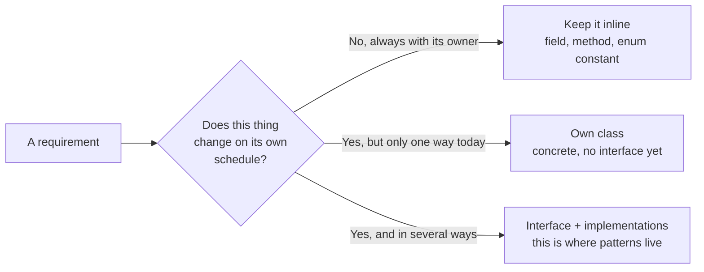

The mistake juniors make is jumping straight to E. The mistake seniors avoid is *staying* at C when
the requirement already told them there were three variants.

---

## Rule 1 — The promotion ladder

Nothing starts as a class. Things get **promoted** as they earn it, and every promotion needs a
trigger. Knowing the triggers is most of the intuition.

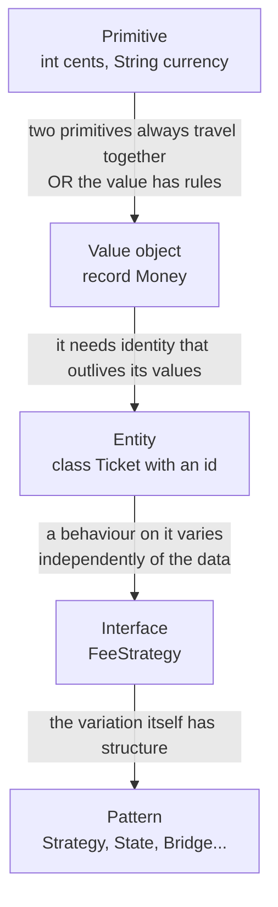

| Promotion | The trigger — do it **only** when this is true | Failure it prevents |
|---|---|---|
| primitive → **value object** | Two or more primitives always appear together, **or** the value has validation/behaviour of its own | Primitive obsession: `transfer(long amount, String currency)` lets you add rupees to dollars and nothing complains |
| value object → **entity** | Two instances with identical field values are still *different things*, and it must be tracked over time | Losing track of which of two identical-looking bookings the customer actually paid for |
| entity → **+ interface** | A behaviour varies for reasons unrelated to the entity's data | A `switch` statement that grows a case every quarter |
| interface → **pattern** | The variation has a recognised shape (algorithm / lifecycle / two axes) | Reinventing a worse Strategy and not being able to name it |

**The test for "should this be a value object?"** — say the field names out loud together. If they
form a phrase (`amount` + `currency` = "money", `startTime` + `endTime` = "a time slot",
`street` + `city` + `zip` = "an address"), the phrase is the class you are missing.

**Entity or value object?** One question: *if I change a field, is it still the same thing?*
Change a `Ticket`'s exit time — same ticket. Change a `Money`'s amount — completely different money.
Identity that survives change means entity; no identity means value object.

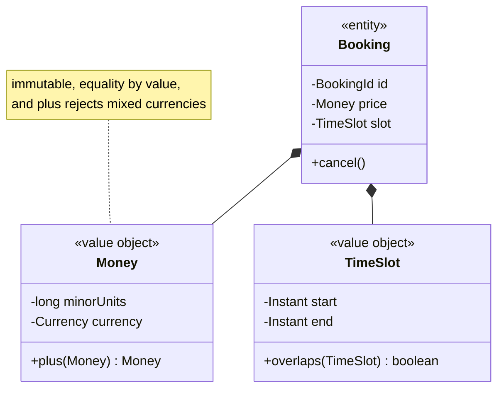

Note where `overlaps` lives: **on `TimeSlot`, not in a `BookingService`**. That is the next rule.

---

## Rule 2 — Where does a behaviour live?

The default answer is *"on the class that owns the data it needs."* You move it off only for a
specific reason.

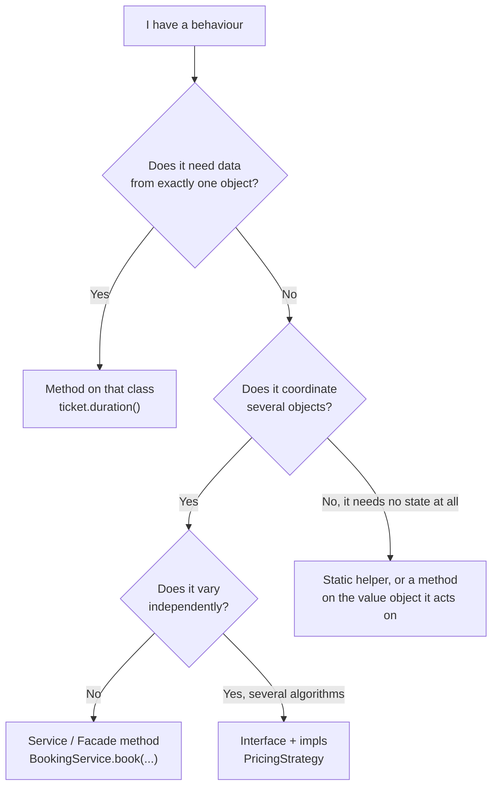

**The anemic-model smell.** If your classes are fields, getters and setters, and every behaviour
lives in `XxxService`, you have written a database schema with Java syntax. The tell is method names
like `TicketUtils.calculateDuration(ticket)` — the argument is doing the work of a receiver.
Compare:

```java
// Anemic — the service reaches into the ticket and does the ticket's job.
long hours = Duration.between(ticket.getEntryTime(), ticket.getExitTime()).toHours();

// Rich — the ticket knows how long it was parked. Nobody else needs its timestamps.
long hours = ticket.parkedHours();
```

The second version also means `getEntryTime()` may not need to exist at all, and that is the real
win: **every getter you delete is a coupling you delete.**

**The counter-force, so you do not overcorrect.** Behaviour that needs data from *many* objects, or
that talks to the outside world (database, HTTP, email), does **not** belong on an entity. A
`Ticket` should not know how to save itself. That is what services and repositories are for.

---

## Rule 3 — When does something become an interface?

This is the question the whole page exists for, and the honest answer is narrower than most people
expect. An interface is not a virtue. It is a **cost** — one more file, one more indirection, one
more hop when reading the code — paid for a specific benefit.

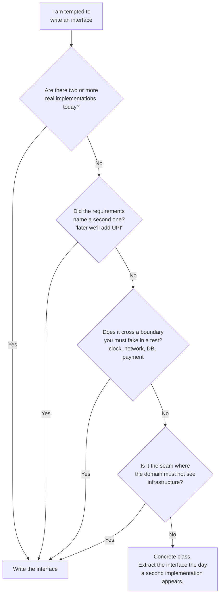

**The four legitimate reasons, and they are the only four:**

| Reason | Example | What you say out loud |
|---|---|---|
| **Genuine polymorphism now** | `FeeStrategy`: hourly, flat, weekend surge | "Pricing is the named axis of change, so it's an interface, not a method body." |
| **A stated future variant** | "we'll add UPI later" | "They told me a second one is coming — that's the extension point." |
| **A test seam** | `Clock`, `PaymentGateway`, `EmailSender` | "I need to test the expiry logic without waiting an hour, so time comes in through an interface." |
| **An architectural boundary** | `BookingRepository` owned by the domain | "The domain defines the interface; JDBC implements it. Dependencies point inward." |

**When NOT to.** One implementation, no stated second, no boundary — that interface is *speculative
generality*, and it reads as pattern-collecting rather than judgement. Extracting an interface later
is a 10-second IDE refactor; the cost of a wrong abstraction is much higher than the cost of a late
one. Say this out loud when you *decline* to add one and it is a strong signal:

> "I could put a `MoveStrategy` behind this, but there's only one rule and none was hinted at. I'll
> keep it concrete and extract an interface the moment there's a second — that refactor is trivial."

**Name interfaces after the role, not the shape.** `FeeStrategy` and `SpotAllocator` describe what
the collaborator *is to you*. `IFeeService`, `AbstractFeeBase` and `FeeInterface` describe your file
layout. If you cannot name an interface without the word "manager", "helper", "util" or "handler",
you probably have not found the abstraction yet.

**The interface belongs to the caller, not the implementer.** This is the subtle one and it is worth
saying in an interview. `BookingRepository` lives in the domain package with the code that *uses*
it, not in the JDBC package that implements it. That is what "dependency inversion" actually means
in a file layout.

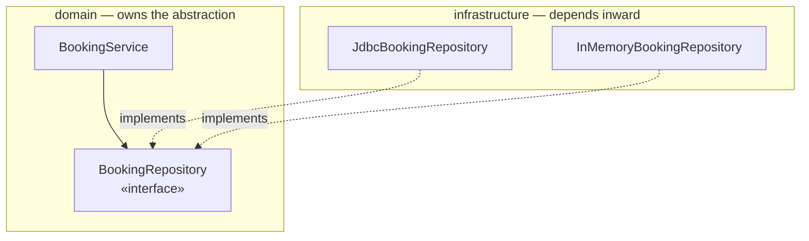

The arrow from infrastructure points **up into** the domain. The domain imports nothing from
infrastructure. Reverse those arrows and you can no longer test the domain without a database.

---

## Rule 4 — Composition over inheritance, and *why*

Everyone can recite "favour composition over inheritance". The intuition is in knowing exactly what
inheritance costs, so you can tell when it is worth paying.

**Inheritance couples you to a class's *implementation*, permanently and invisibly.** A subclass
depends on which methods the parent calls internally — change that and subclasses break without any
signature changing. Composition couples you only to a published interface.

**The test that decides it in one second:** substitutability.

> Can I hand a subclass to **every single** piece of code that expects the parent, and have it behave
> correctly, with no caller ever checking the type?

If there is even one place that would need `if (x instanceof Square)`, inheritance is wrong. That is
the Liskov Substitution Principle stated as something you can actually check.

### The canonical failure

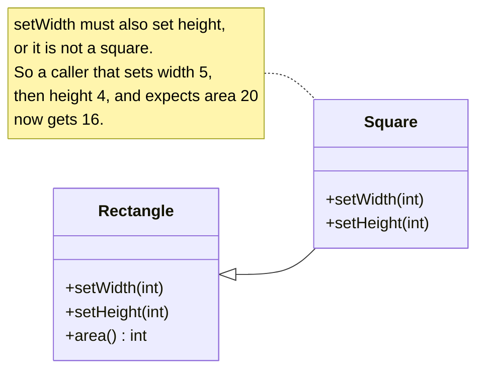

`Square` **is-a** `Rectangle` in geometry and **is not** a `Rectangle` in code, because a `Rectangle`
promises that width and height move independently. Inheritance inherits the *promises*, not just the
fields. The fix is composition: a `Square` **has-a** side length, and both expose a common `Shape`
interface with no mutable width.

### The realistic failure: the subclass explosion

Requirements arrive one at a time, and each one doubles your class count.

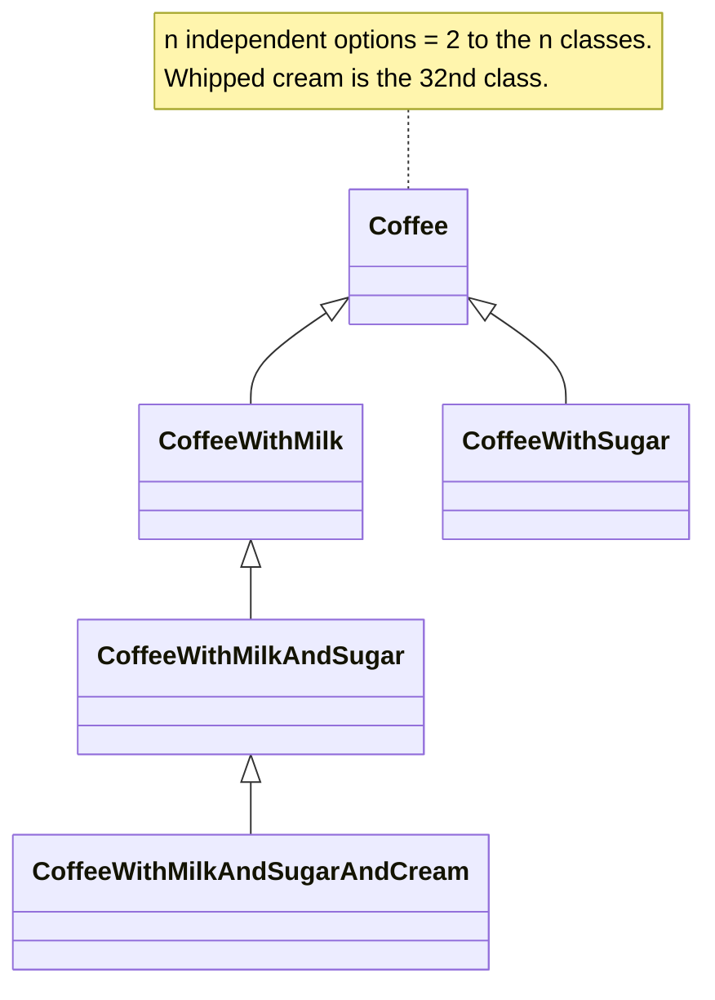

Composition turns 2ⁿ classes into n:

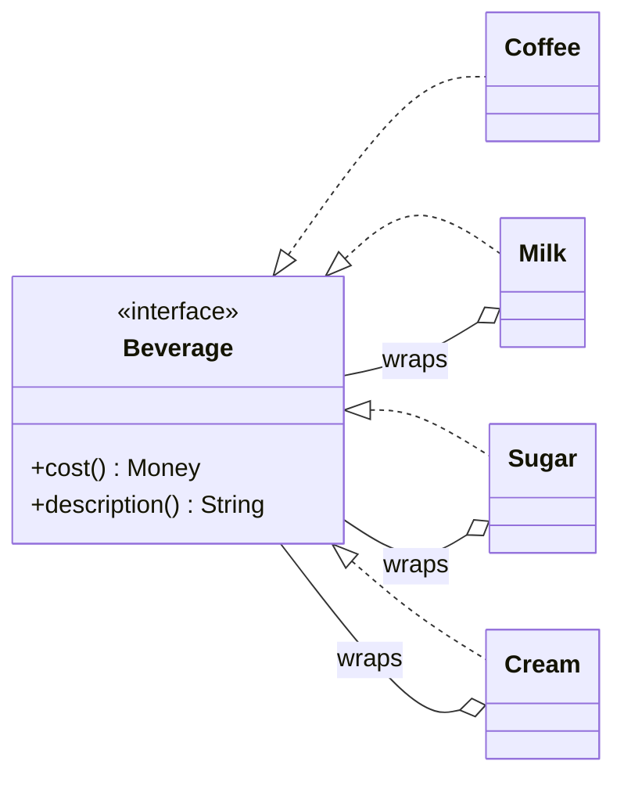

That is the Decorator pattern, but notice you did not need to know its name to get here — you got
here by asking *"what changes independently?"* and finding that each option varies on its own. **The
pattern is the destination, not the route.**

### The three-way choice, side by side

| | Inheritance (`extends`) | Composition (a field) | Interface only (`implements`) |
|---|---|---|---|
| Says | "is-a, and substitutable" | "has-a / uses-a" | "can-do" |
| Bound at | compile time, permanently | runtime, swappable | compile time, but no code inherited |
| Reuses | implementation | behaviour, through delegation | nothing — contract only |
| Breaks when | the parent changes what it calls internally | the collaborator's interface changes | the contract changes |
| Java limit | one superclass | unlimited | unlimited |
| Use it for | a genuine, stable, substitutable specialisation | almost everything else | capabilities that cut across the hierarchy |

**When inheritance *is* right** — say these out loud so it does not sound like you are avoiding it:
- **Template Method.** The parent owns an invariant sequence and subclasses fill in steps. The
  coupling is intentional and documented — that is the entire point of the pattern.
- **Sealed hierarchies / sum types.** `sealed interface Shape permits Circle, Square` models a closed
  set of alternatives, and the compiler checks exhaustiveness for you.
- **Framework extension points** where the base class is a published, stable contract.

### Capability interfaces: the escape hatch from a bad hierarchy

When some things can do something and others cannot, do **not** add it to the base class and throw
`UnsupportedOperationException` — that is an LSP violation with extra steps.

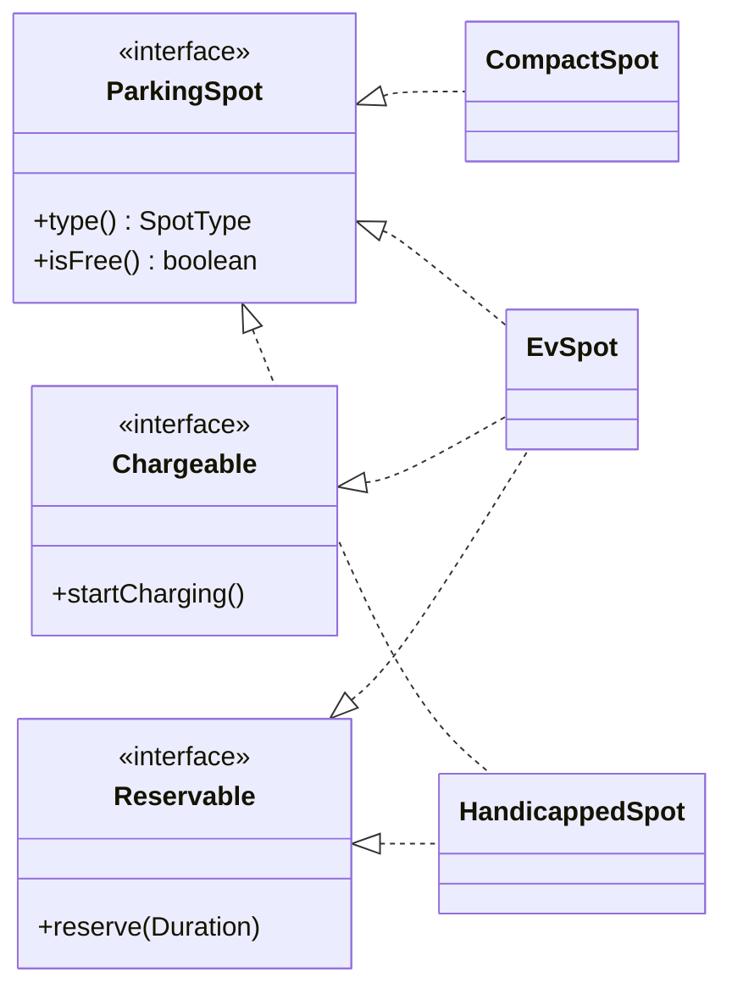

Now `EvSpot` has charging because it *is* chargeable, and `CompactSpot` has no method it cannot
honour. This is Interface Segregation doing real work rather than being quoted.

---

## Rule 5 — Who owns what? (composition vs aggregation)

Getting ownership right is what makes a design feel solid, and interviewers probe it with *"what
happens to X when Y is deleted?"*

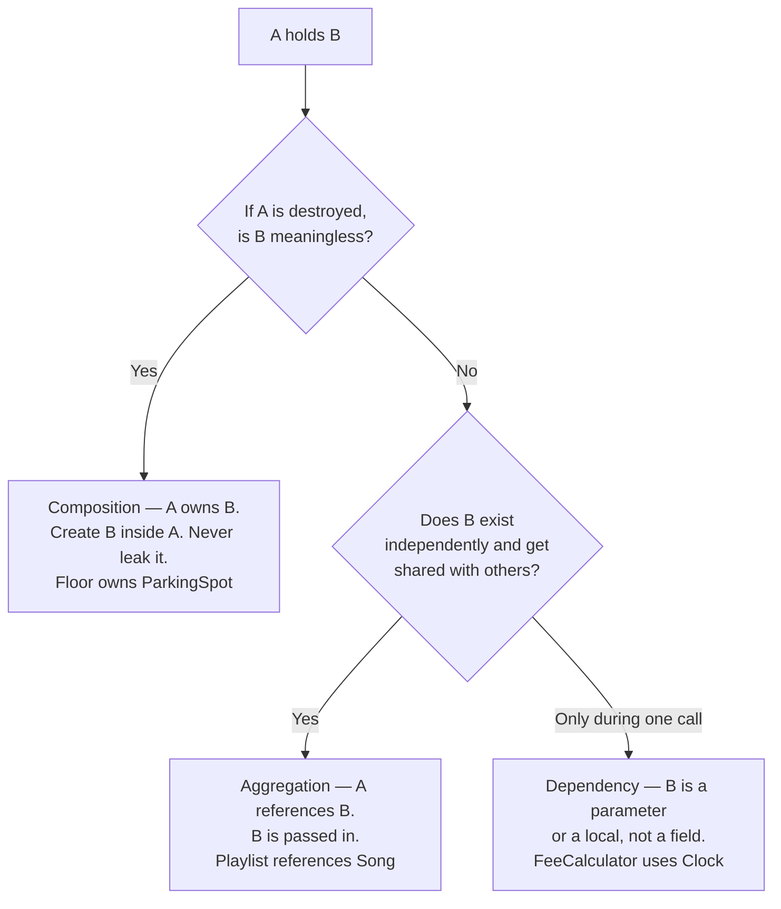

**Ownership decides three things at once:** who constructs it, who validates it, and who is allowed
to mutate it. If `Floor` owns its spots, then `Floor` creates them, `Floor` enforces "no two spots
with the same number", and **nothing outside `Floor` may mutate a spot**. Which leads directly to:

**Never return your internal collection.** `getSpots()` returning the live `List` hands every caller
the ability to break your invariant, and no amount of validation elsewhere can save you. Return
`List.copyOf(...)`, an unmodifiable view, or — better — do not return it at all and expose the
operation the caller actually wanted (`floor.findFreeSpot(type)`).

---

## Rule 6 — Tell, don't ask (and the Law of Demeter)

The single fastest way to spot a design that will not survive change is a chain of getters.

```java
// Ask — the caller knows the shape of three objects it does not own.
if (order.getCustomer().getAddress().getCountry().equals("IN")) { ... }

// Tell — the caller states intent; each object answers for its own data.
if (order.isDomestic()) { ... }
```

The first line breaks if `Customer` changes how it stores an address, if `Address` renames
`getCountry()`, or if any link in the chain is ever `null`. The second breaks only if the *concept*
of "domestic" changes.

**Law of Demeter, stated usefully:** a method may only call methods on
(1) itself, (2) its own fields, (3) its parameters, and (4) objects it just created. **One dot of
navigation, not four.** It is a heuristic, not a law — fluent builders and streams break it happily
and that is fine, because they return the *same conceptual thing*. The rule is really about
navigating *other people's* object graphs.

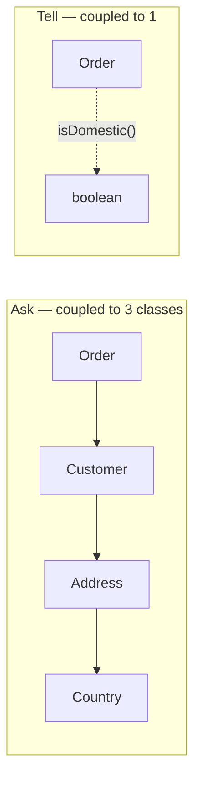

---

## Rule 7 — Cohesion and coupling, made checkable

These two words get said a lot and measured never. Here is how to actually feel them.

**Low cohesion, detected in 5 seconds:** describe the class's responsibility in one sentence. If you
need "and", split it. `UserManager` that "validates users **and** sends emails **and** writes to the
database" is three classes wearing one name.

**A second detector:** group the methods by which fields they touch. If two groups touch disjoint
field sets, the class is already two classes and the compiler is the only thing that has not noticed.

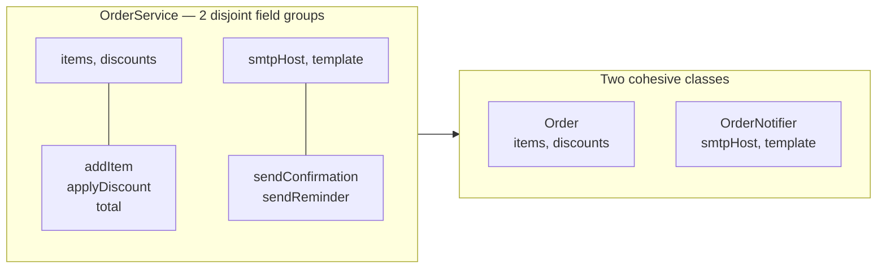

**High coupling, detected in 5 seconds:** count the imports, and count the reasons this file gets
edited. A class edited for pricing changes *and* for schema changes *and* for email-template changes
has three masters — that is Single Responsibility stated as "one reason to change".

**The counter-force, and it matters.** Splitting a class whose parts always change *together* makes
things worse: now one requirement touches four files. Cohesion is not "small classes", it is
"things that change together live together". Nine tiny classes that must all be edited for any
change are worse than one class of ninety lines.

---

## Rule 8 — Make illegal states unrepresentable

The strongest form of encapsulation is not a private field — it is a design where the bad state
cannot be constructed at all. This is what separates a design that *checks* for bugs from one that
*cannot have them*.

| Weak | Strong |
|---|---|
| `Meeting` with public setters, validated in a service | `record Meeting(...)` whose compact constructor rejects `end <= start` |
| `status` as a `String` | `enum Status`, so a typo is a compile error |
| `Ticket` with a nullable `spot`, checked everywhere | a constructor that requires a `Spot`, so a spotless ticket cannot exist |
| `double price` | `Money` that refuses to add two currencies |
| `boolean isPaid` + `boolean isCancelled` (4 states, 2 illegal) | one `enum State { PENDING, PAID, CANCELLED }` |

That last row is the one worth internalising: **n booleans encode 2ⁿ states, and you usually only
meant 3 of them.** Every extra boolean flag on a class is a question about which combinations are
legal — replace them with an enum or a sealed hierarchy and the illegal combinations stop existing.

---

## Smell → the move

The fast lookup. Each row is a thing you can *see* in code, and the specific refactor it calls for.

| What you see | What it means | The move |
|---|---|---|
| Two parameters always passed together | A missing concept | Extract a value object |
| `String type` / `int status` with meaning | Stringly-typed | Enum, and consider behaviour on it |
| `switch` on a type that will grow | Behaviour belongs on the type | Polymorphism, or Strategy |
| Method that only calls getters on its argument | Feature envy — it wants to live there | Move the method onto that class |
| `getA().getB().getC()` | Law of Demeter violation | Add an intention-revealing method to `A` |
| Subclass overrides a method to do nothing | Not substitutable — LSP violation | Composition, or split the interface |
| Subclass throws `UnsupportedOperationException` | Fat base class | Capability interfaces |
| A class with `and` in its responsibility | Low cohesion | Split it |
| Nine fields, some always null together | Two classes hiding in one | Split, or use a sealed hierarchy |
| Interface with exactly one implementation, forever | Speculative generality | Delete the interface |
| Class named `...Manager` / `...Helper` / `...Util` | The abstraction was never found | Name the actual responsibility |
| Constructor with 6+ parameters | Missing grouping, or doing too much | Value objects, or Builder |
| `new` on a collaborator inside a method | Untestable hard dependency | Inject it |
| Boolean parameter that changes what the method does | Two methods wearing one name | Split into two named methods |

---

## Worked derivation — from a paragraph to a model

> *"Users borrow books from a library. A book can have several copies. A member can hold at most 5
> books at a time, for 14 days. Overdue books incur a daily fine. Members can reserve a book that is
> currently out."*

**Step 1 — nouns, unfiltered.** user, book, copy, member, library, hold, day, fine, reservation.

**Step 2 — classify each, using the tests above.**

| Noun | Test applied | Verdict |
|---|---|---|
| `Book` | Two copies of *Dune* are the same book | **Entity** — identity is the ISBN |
| `BookCopy` | Copy #3 and copy #7 are different physical things | **Entity** — separate identity, separate state |
| `Member` | Tracked over time, identity survives changes | **Entity** |
| `Loan` | "borrowing" is a *thing* with a due date and a return date | **Entity** — this is the noun hiding in a verb |
| `Fine` | Money + a reason. Change the amount, it is a different fine | **Value object** |
| `LoanPeriod` / due date | 14 days is policy, not data | **Policy — see step 4** |
| `Reservation` | Has a queue position and an expiry | **Entity** |
| `library` | The whole system, not a thing in it | **Facade / service**, not a domain entity |

**The single most important line above is `Book` vs `BookCopy`.** Candidates who model one `Book`
with a `count` field cannot answer "which copy is overdue?", "which copy is damaged?", or "who has
copy #3?" — and that is exactly what the interviewer asks next. **Verbs that have their own data and
lifecycle are entities too:** "borrow" became `Loan`, and that is where the due date, the return
date, and the fine calculation all live.

**Step 3 — first cut, with ownership.**

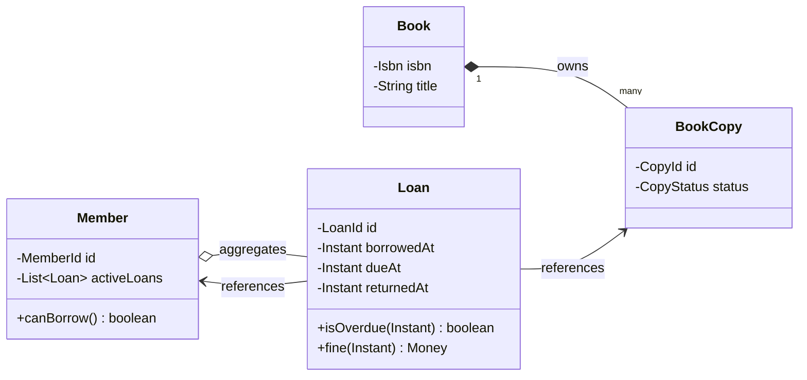

Read the arrows: a `BookCopy` cannot exist without its `Book` (composition, filled diamond); a `Loan`
*references* a member and a copy but owns neither (association).

**Step 4 — now, and only now, ask what varies.** This is where interfaces are earned:

| Requirement | Does it vary? | Decision |
|---|---|---|
| Max 5 books | Yes — students vs staff vs premium | `BorrowingPolicy` **interface**. The number 5 is not a constant, it is a policy. |
| 14-day period | Yes — same axis, same interface | `BorrowingPolicy.loanPeriod(member)` |
| Daily fine | Yes — flat, tiered, capped, waived | `FinePolicy` **interface** |
| Overdue check | No — it is `now > dueAt`, always | **Method on `Loan`.** No interface. |
| Where loans are stored | Yes — in-memory now, DB later | `LoanRepository` **interface** (boundary + test seam) |
| Reservation queue order | No — FIFO, and nothing hinted otherwise | Plain `Deque` inside `Reservation`. Say you'd extract it if priority tiers appear. |

Two of those six are deliberate **noes**, and saying them out loud is the difference between "applies
patterns" and "applies patterns with judgement":

> "Overdue is just `now.isAfter(dueAt)` — I'll keep that as a method on `Loan` rather than a policy
> interface, because there's no second definition of 'late'. If they add grace periods, it becomes a
> policy and that's a two-minute change."

**Step 5 — the design, with the seams in it.**

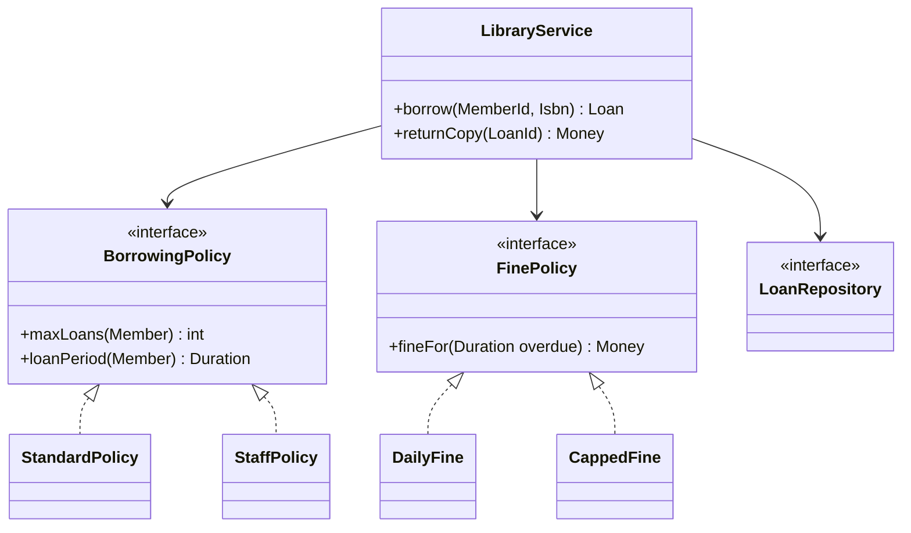

Three interfaces, each with a stated reason. Everything else stayed a concrete class — and that
restraint is the point.

---

## Drills — build the intuition, do not read about it

Do these on paper, in under two minutes each. The answer is not a pattern name; it is a *reason*.

1. **Promote or not?** `void schedule(String room, long startMillis, long endMillis)`. Which
   parameters want to become one class, and what does that class make impossible?
2. **Interface or not?** You have exactly one `EmailSender`. Should it be an interface? *(Yes — test
   seam and boundary. Now: exactly one `SlugGenerator` used only by the domain — should it? Why not?)*
3. **Inheritance check.** `SavingsAccount extends Account` where savings accounts cannot be
   overdrawn. Substitutable? What breaks in a caller that transfers between two `Account`s?
4. **Find the missing noun.** "A driver accepts a ride request, picks up the rider, and completes the
   trip." Three verbs. Which one is secretly an entity, and what data proves it?
5. **Ownership.** A `Playlist` holds `Song`s. Delete the playlist — what happens to the songs?
   Now do the same for `Floor` and `ParkingSpot`. Which arrowhead differs, and why?
6. **Kill a boolean.** A class has `isSubmitted`, `isApproved`, `isPaid`. How many states does that
   encode, how many are legal, and what replaces them?
7. **Feature envy.** Find any method in your own code that only calls getters on one parameter.
   Move it. Notice how many getters you can now delete.

---

## What to say out loud

Modelling decisions are invisible unless you narrate them. These are the sentences that land:

- *"Two copies of the same book are different physical things, so `BookCopy` gets its own identity."*
- *"`amount` and `currency` always travel together and adding two currencies must be impossible —
  that's a `Money` value object."*
- *"Pricing is the axis that changes, so it goes behind an interface. Overdue-checking isn't, so it
  stays a method."*
- *"An electric car is a car **with** a battery, not a kind of car — I'll compose rather than extend."*
- *"I'll keep this concrete for now. If a second implementation shows up, extracting the interface is
  a 10-second refactor, and a wrong abstraction costs a lot more than a late one."*
- *"`Floor` owns its spots, so nothing outside `Floor` gets a mutable reference to one."*
- *"Three booleans is eight states and I only mean three — that's an enum."*

---

## Runnable proof

Every rule above fails loudly when broken, and
[`src/com/lld/foundations/modelling/`](../../src/com/lld/foundations/modelling/ModellingDemo.java)
reproduces those failures rather than describing them: currencies silently added together until a
value object makes it impossible, an LSP violation breaking a caller that was correct for the base
type, the subclass explosion counted class by class, a train-wreck getter chain that survives one
refactor and not the next, and boolean flags encoding states nobody meant.

```powershell
java -cp out com.lld.foundations.modelling.ModellingDemo
```

---

Next: [SOLID.md](SOLID.md) for the principles these rules come from, or
[../reference/PROBLEMS.md](../reference/PROBLEMS.md) to watch the rules applied to 26 real problems.
